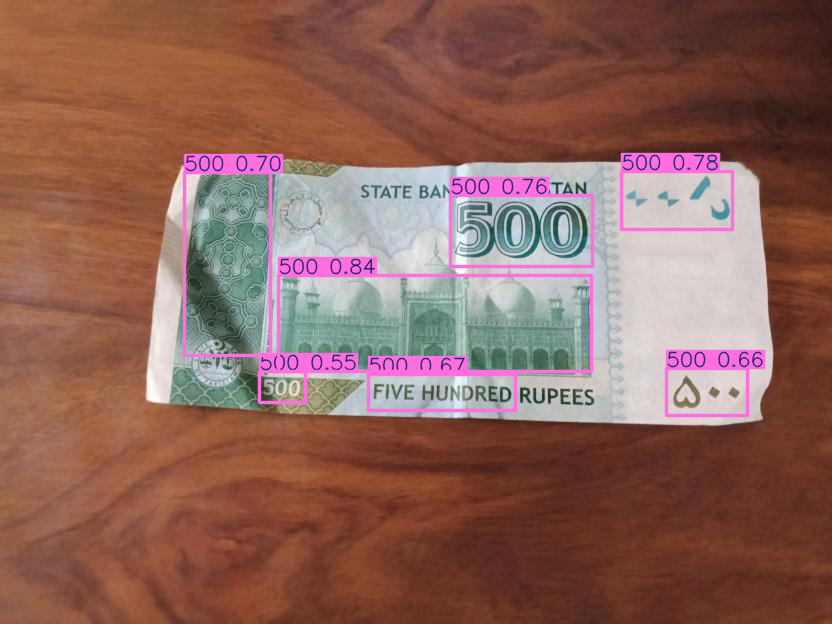
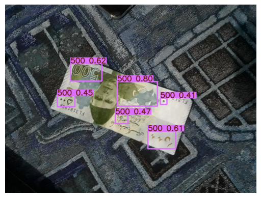
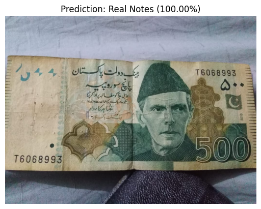
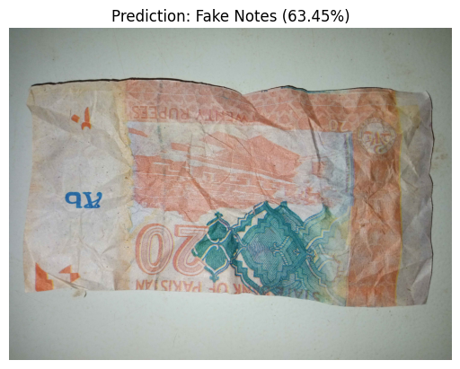

# PakCurrency VisionAI

A comprehensive computer vision–based system for Pakistani currency denomination detection and fake-note verification using state-of-the-art deep learning models.

## 🎯 Project Overview

This project implements an AI-powered solution for:
1. **Currency Denomination Detection** - Identifying Pakistani currency note denominations using YOLOv11
2. **Fake Note Verification** - Classifying notes as authentic or counterfeit using a fine-tuned VGG16 model
3. **Unified Inference Pipeline** - Combined predictions for both denomination and authenticity

## 📊 Notebooks

### 1. Note Denomination Detection
[](https://colab.research.google.com/github/Saad-Shakeel/PakCurrency-VisionAI/blob/main/01_note_denomination_detection.ipynb)

Trains a YOLOv11 model for detecting and classifying Pakistani currency note denominations.


### 2. Note Authenticity Verification
[](https://colab.research.google.com/github/Saad-Shakeel/PakCurrency-VisionAI/blob/main/02_note_authenticity_verification.ipynb)

Builds and trains a deep learning model for distinguishing between real and fake Pakistani currency notes.


### 3. Inferencing Pipeline
[](https://colab.research.google.com/github/Saad-Shakeel/PakCurrency-VisionAI/blob/main/03_inferencing.ipynb)

Combined inference pipeline for both denomination detection and authenticity verification.


## 🚀 Quick Start

### 1. Training Denomination Detection Model
Open `01_note_denomination_detection.ipynb` and:
- Set your Roboflow API key
- Run all cells to train the YOLOv11 model
- Export model to ONNX format

### 2. Training Authenticity Verification Model
Open `02_note_authenticity_verification.ipynb` and:
- Download dataset from Google Drive (automatic)
- Run training cells
- Convert model to TensorFlow Lite format

### 3. Running Inference
Open `03_inferencing.ipynb` and:
- Load pre-trained models from `models/` directory
- Provide test image paths
- Get predictions for denomination and authenticity

## 🎨 Demo Results

### Note Denomination Detection
YOLOv11 detects and classifies Pakistani currency denominations with bounding boxes and confidence scores.

| Detection Example 1 | Detection Example 2 |
|---|---|
|  |  |

### Note Authenticity Verification
VGG16-based classifier distinguishes between real and fake Pakistani currency notes.

| Detection Example 3 | Detection Example 4 |
|---|---|
|  |  |


## 🎓 Usage Examples

### Denomination Detection
```python
from ultralytics import YOLO

model = YOLO('models/best.onnx')
results = model('path/to/image.jpg')
results[0].show()
```

### Authenticity Verification
```python
import tensorflow as tf
import numpy as np

interpreter = tf.lite.Interpreter(model_path='models/vgg16_finetuned_model.tflite')
interpreter.allocate_tensors()

# Preprocess image and run inference
# Get prediction: Real Notes or Fake Notes
```

## 🔐 Dataset

- **Denomination Detection:** Roboflow - Pakistani Currency Note Dataset
- **Authenticity Verification:** Custom dataset of real and fake Pakistani currency notes

## 📧 Contact

For questions or contributions, please reach out via GitHub.

---
